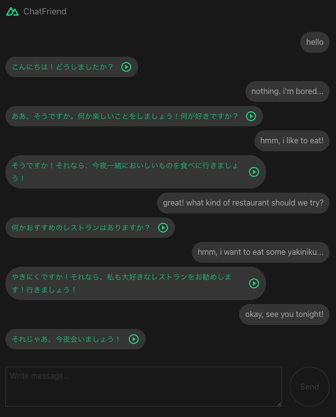

openai-chatfriend
=======

This project is a chatbox application built using [Nuxt 3](https://nuxt.com/v3) powered by [OpenAI Text completion endpoint](https://beta.openai.com/docs/guides/completion).

In the future, you can select different personality of your AI friend that you want to chat. It will then emulates normal conversation between friends. 

The default AI friend will respond in Japanese. You can use this app to practice chatting with a Japanese person!


# The App



By writing a descriptive introduction in your prompt, it is possible to create different personality of your AI chat friend. Depending on the availability, the reply will be spoken using [Web Speech API](https://developer.mozilla.org/en-US/docs/Web/API/Web_Speech_API).

Moving forward, my main objective is to be able to transcribed speech into text, send it to an AI endpoint (for now `Completion endpoint`, maybe `ChatGPT` in the future), get the result and translate it to text to speech, making a proper `Voice Chat app`. But that is just one application. You can probably stick that app into an actual device, say a robot dog or cat, thus giving them the ability to converse to their owners. Imagine a talking cat! lol

However, the first part, speech to text, seem to be not straight forward and involved some other technology I am not familiar as of this time, well, for now...

> This is purely a personal coding exercise to get to know `Nuxt 3`.

# Development

> This is a work in progress...

I will be using the latest version of `Nuxt`

```sh
$ npx nuxi init <project-name>
```

Check the [installation guide](https://nuxt.com/docs/getting-started/installation) for more info.


# OpenAI

To install `OpenAI` node module

```sh
$ npm install openai
```

You will need an actual `API Key` to use it so register for an account at [OpenAI](https://openai.com/api/).

Make sure to store your `API Key` in safe manner, preventing it from exposing to the client side.
As for this project, the actual `API Key` will be stored at `.env` file which is not included in the repository.

`.env` file
```javascript
NUXT_API_KEY=my-openai-api-key-sample
```

Then we will only be calling the openai's `completion endpoint` from our own server api endpoint.

`/server/api/chat.js` file
```javascript
import { Configuration, OpenAIApi } from "openai";

const config = useRuntimeConfig();

const configuration = new Configuration({
    apiKey: config.apiKey,
});

const openai = new OpenAIApi(configuration);

export default defineEventHandler(async (event) => {

    const completion = await openai.createCompletion({
        model: "text-davinci-003",
        prompt: "You: Hello!\nFriend: How are you?\nYou: Good morning!\nFriend:",
        temperature: 0.5,
        max_tokens: 60,
        top_p: 1,
        frequency_penalty: 0.5,
        presence_penalty: 0,
        stop=["You:"]
    });

    return {
        text: completion.data.choices[0].text,
    }

})
```

# Setup

Clone the repository and install the dependencies

```sh
$ git clone https://github.com/supershaneski/openai-chatfriend.git myproject

$ cd myproject

$ npm install
```

Create `.env` file in the root directory and supply your own `OpenAI API Key`

`.env` file
```javascript
NUXT_API_KEY=my-openai-api-key-sample
```

Then run the app

```sh
$ npm run dev
```

Open your browser to `http://localhost:5000/` to load the application page.


# Additional Information

Look at the [Nuxt 3 documentation](https://nuxt.com/docs/getting-started/introduction) to learn more.

## Production

Build the application for production:

```bash
npm run build
```

Locally preview production build:

```bash
npm run preview
```

Check out the [deployment documentation](https://nuxt.com/docs/getting-started/deployment) for more information.
