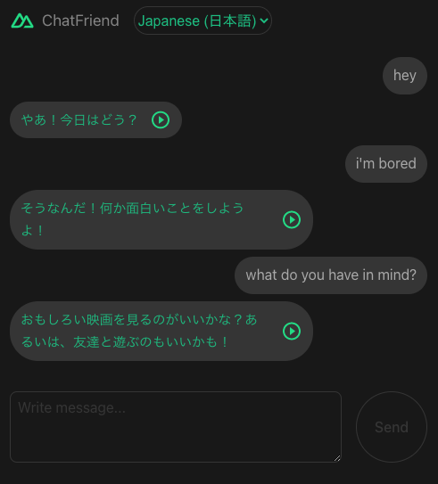
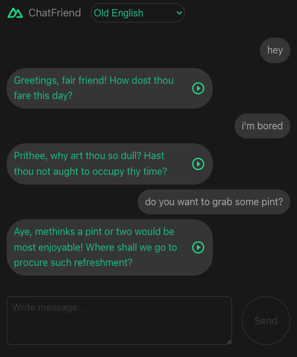

openai-chatfriend
=======

This project is a chatbox application built using [Nuxt 3](https://nuxt.com/v3) powered by [OpenAI Text completion endpoint](https://beta.openai.com/docs/guides/completion).

You can select different personality of your AI friend that you want to chat. It will then emulate normal conversation between friends. The default AI friend will respond in Japanese. You can use this app to practice chatting with a Japanese person!

このチャットボックスアプリは、`Nuxt 3`を使用して開発され、`OpenAIのテキスト完成エンドポイント`によって動作します。将来的には、AIの個性を選択することが可能になるかもしれません。現在は、デフォルトで日本語で応答します。このアプリを使用することで、日本語のチャットスキルを練習することができます。

> Japanese description generated by ChatGPT (^ ‿ ^)


# The App

## Japanese (日本語)


## Old English


## American English


## Filipino

> There are no Filipino voice available from `Speech Synthesis` api so the play button is removed.


By writing a descriptive introduction in your prompt, it is possible to create different personality of your AI chat friend. Depending on the availability, the reply will be spoken using [Web Speech API](https://developer.mozilla.org/en-US/docs/Web/API/Web_Speech_API).

Moving forward, my main objective is to be able to transcribed speech into text (using [Whisper](https://openai.com/blog/whisper/)), send it to an AI endpoint (for now `Completion endpoint`, maybe `ChatGPT` in the future), get the result and translate it to text to speech (using `Web Speech API`), making a proper `Voice Chatbox app`. But that is just one application. You can probably stick a similar app into an actual device, say a robot dog or cat, thus giving them the ability to converse to their owners. Imagine a talking cat! lol

> This is purely a personal coding exercise to get to know `Nuxt 3`.

# Development

> This is a work in progress...

I will be using the latest version of `Nuxt`

```sh
$ npx nuxi init <project-name>
```

Check the [installation guide](https://nuxt.com/docs/getting-started/installation) for more info.


# OpenAI

To install `OpenAI` node module

```sh
$ npm install openai
```

You will need an actual `API Key` to use it so register for an account at [OpenAI](https://openai.com/api/).

Make sure to store your `API Key` in safe manner, preventing it from exposing to the client side.
As for this project, the actual `API Key` will be stored at `.env` file which is not included in the repository.

`.env` file
```javascript
NUXT_API_KEY=my-openai-api-key-sample
```

Then we will only be calling the openai's `completion endpoint` from our own server api endpoint.

`/server/api/chat.js` file
```javascript
import { Configuration, OpenAIApi } from "openai";

const config = useRuntimeConfig();

const configuration = new Configuration({
    apiKey: config.apiKey,
});

const openai = new OpenAIApi(configuration);

export default defineEventHandler(async (event) => {

    const completion = await openai.createCompletion({
        model: "text-davinci-003",
        prompt: "You: Hello!\nFriend: How are you?\nYou: Good morning!\nFriend:",
        temperature: 0.5,
        max_tokens: 60,
        top_p: 1,
        frequency_penalty: 0.5,
        presence_penalty: 0,
        stop=["You:"]
    });

    return {
        text: completion.data.choices[0].text,
    }

})
```

## max_tokens

The `max_tokens` value plus the token count of the prompt should not exceed 2048 (or 4096 for newest models).

In the application, I set my own ceiling much lower (1800 tokens, 1 token = 4 chars).
If the total token count exceed this number, I removed a number of old messages.
Since the conversation is already too long, removing previous messages will probably not impact the current flow of conversation.


# Setup

Clone the repository and install the dependencies

```sh
$ git clone https://github.com/supershaneski/openai-chatfriend.git myproject

$ cd myproject

$ npm install
```

Create `.env` file in the root directory and supply your own `OpenAI API Key`

`.env` file
```javascript
NUXT_API_KEY=my-openai-api-key-sample
```

Then run the app

```sh
$ npm run dev
```

Open your browser to `http://localhost:5000/` to load the application page.


# Additional Information

Look at the [Nuxt 3 documentation](https://nuxt.com/docs/getting-started/introduction) to learn more.

## Production

Build the application for production:

```bash
npm run build
```

Locally preview production build:

```bash
npm run preview
```

Check out the [deployment documentation](https://nuxt.com/docs/getting-started/deployment) for more information.
